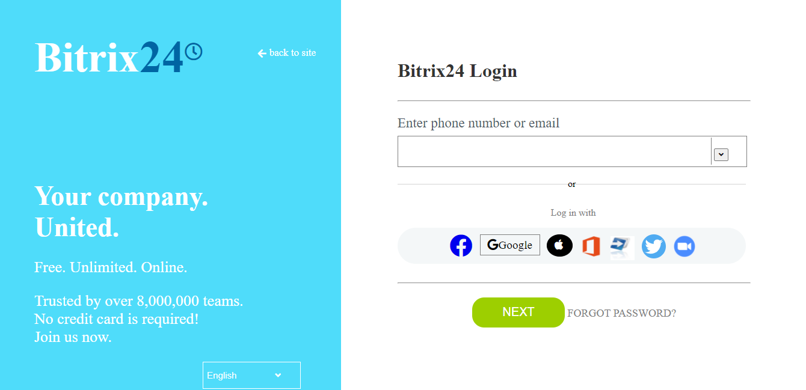

# Bitrix24 Clone

<!-- PROJECT LOGO -->
<br />
<p align="center">
  <a href="https://github.com/narendrapalacharla/carbonProject.git">
    CARBON TEAM
  </a>

  <h3 align="center">Bitrix24</h3>

  <p align="center">
    we are assigned with Bitrix24.net clone !
    <br />
    <a href="https://github.com/narendrapalacharla/carbonProject.git"><strong>Explore our work here»</strong></a>
    <br />
    <br />
    <a href="https://github.com/narendrapalacharla/carbonProject/issues">View issues</a>
    ·
    <a href="https://github.com/narendrapalacharla/carbonProject/commits/master">Total commits</a>
    ·
    <a href="https://github.com/narendrapalacharla/carbonProject/pulls">pull requests</a>
  </p>
</p>


<!-- TABLE OF CONTENTS -->
<details open="open">
  <summary>Table of Contents</summary>
  <ol>
    <li>
      <a href="#about-the-project">About The Project</a>
      <ul>
        <li><a href="#built-with">Built With</a></li>
      </ul>
    </li>
    <li>
      <a href="### Clone">Clone Repo</a>
    </li>
    <li><a href="#contribution">Contribution Team</a></li>
    <li><a href="#contact">Contact</a></li>
  </ol>
</details>


<!-- ABOUT THE PROJECT -->
## About The Project

[OPTIMIZELY](https://www.optimizely.com/)

Bitrix24.net is a social enterprise network & a united workspace tool which handles the many aspects of daily operations and tasks of any organization. it also helps employees to share their thoughts, collab, and interact with each other.

## Overview Section

Navbar, left-sidebar,right-sidebar, and footers, all combined referred to as an outer structure(skeleton), there are a decent number of functionalities in this section like:
Toggling the middle part, with a left-slide bar.
At the same, Navbar elements are also to be toggled with their positions.
Implement timer on the navbar.
A side panel feature is added on the intro feed page.

## How to get a development environment running
   In order to use the project you need to follow the below steps.
   1. Open landingPage.html using VS code live server, this is our landing Page.
   2. You can login to main website page on clicking the facebook icon.
   3. Now , you will be landed on the main page of website .
   4. Here, you can go through the introduction video of Bitrix and you will be easily understood about the product.
   5. This is our Task and Projects page where you can add a new Task and also delete the tasks.
   6. This is out Chats & calls page , here you can chat with your colleagues.
   7. This is Workgroups page .
   8. This is our drive page , where you can upload new files and see any file if you want.
   9. This is Calendar page where you can add events for the particular date and also delete if incase that got cancelled.
   10. This is our Time & Reports Page , here you can see basically status of your employees like (WorkingTime, Absence chart, reports , meetings )
   11. This is CRM page , here you can see the status of your accounts management like (new projects , invoices pending and Final invoices).
  
## Deployment 
   In this project we were able to achieve a near to perfect clone of the original website. But it is very large website , so in the given time constraints it was not possible to clone all the webpages . We tried our best to clone the maximum pages as we can. Finally we were achieved our target to clone the main important functionality pages of the website. As we do not want to overwhelm you with the snapshots, we haven't shared all the pages here. Please fork the repository and then use it on your own. 
   
### Built With

* [HTML](https://html.com)
* [CSS](https://css.com)
* [JS](https://javascript.com)


<!-- GETTING STARTED -->
### Clone


1. Clone the repo
   ```sh
   git clone https://github.com/narendrapalacharla/carbonProject.git
   ```
<!-- CONTRIBUTING -->
## Contributors 
   - **Divya prakash**

     - **Github** : divy25 <br>
     - **LinkedIn** : Divya Prakash

   - **Narendra Palacharla**

     - **Github**  : narendrapalacharla <br>
     -  **LinkedIn** : Narendra Palacharla

   - **Suraj Singh** 

     - **Github** : suraj588 <br>
     - **LinkedIn** : Suraj Singh

<!-- CONTACT -->
## Contact

Your Name - [my twitter](https://twitter.com/narendrapalach1)

Project Link: [project repo](https://github.com/narendrapalacharla/carbonProject.git)

## Acknowledgment
i took some inputs from these resources,i would be thankful to them as well.
1) [source](https://github.com/othneildrew/Best-README-Template#built-with)  
2) [wikipedia](https://www.wikipedia.org)
3) [wikipedia](https://www.w3schools.com)
4) [fullcalendar](https://www.fillcalendar.io)
5) [MDN docs](https://developer.mozilla.org/en-US/)


   

